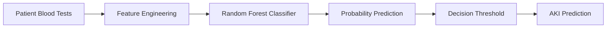

# Acute Kidney Injury Prediction

> A machine learning system for predicting Acute Kidney Injury (AKI) from patient blood test data using engineered clinical features and Random Forest classification.


---

## Overview

Acute Kidney Injury (AKI) is a common indicator of patient deterioration and requires early detection to enable timely clinical intervention. Machine learning models can support this process by identifying patients at risk using routinely collected laboratory measurements.

This project presents a machine learning pipeline for predicting **Acute Kidney Injury (AKI)** from patient demographics and historical creatinine measurements.

The project was developed as part of the **Software Engineering for Machine Learning Systems (SWEMLS)** module at **Imperial College London**.

---

## Objectives

The project aims to:

- Predict the presence of Acute Kidney Injury.
- Engineer clinically meaningful features from historical creatinine measurements.
- Optimise model performance for recall-oriented clinical prediction.
- Produce predictions compatible with the provided evaluation framework.

---

## Problem Statement

Acute Kidney Injury is commonly identified using changes in serum creatinine measurements.

Because failing to identify a patient with AKI may have serious clinical consequences, the coursework evaluates submissions using the **F3 Score**, which places greater emphasis on **Recall** than Precision.

---

## Machine Learning Pipeline



---

## Repository Structure

```text
acute-kidney-injury-prediction/
│
├── model.py
│   Training and inference pipeline.
│
├── training.csv
│   Training dataset.
│
├── aki.csv
│   Generated predictions.
│
├── requirements.txt
│   Python dependencies.
│
├── Dockerfile
│   Container configuration.
│
└── README.md
```

---

## Feature Engineering

The model extracts clinically relevant features including:

- Patient age
- Patient sex
- Latest creatinine measurement
- Estimated baseline creatinine
- Absolute creatinine change
- Relative creatinine change
- Mean historical creatinine
- Maximum historical creatinine
- Standard deviation of historical creatinine

These features are generated dynamically based on the available laboratory measurements.

---

## Model

The prediction system uses a **Random Forest Classifier** configured for binary classification.

Key characteristics include:

- Random Forest classification
- Class-weighted learning
- Recall-oriented optimisation
- Threshold-based prediction
- Interpretable tabular feature representation

---

## Running the Project

Install dependencies:

```bash
pip install -r requirements.txt
```

Run the prediction pipeline:

```bash
python model.py
```

The pipeline automatically:

- Loads the training dataset
- Performs feature engineering
- Trains the Random Forest model
- Generates predictions
- Saves predictions to `aki.csv`

---

## Technologies

- Python
- scikit-learn
- pandas
- NumPy
- Docker

---

## Evaluation

Performance is evaluated using the **F3 Score**, which prioritises recall over precision to minimise false negatives in a clinical setting.

---

## Future Improvements

Potential extensions include:

- XGBoost
- LightGBM
- CatBoost
- SHAP-based model explainability
- Hyperparameter optimisation
- Probability calibration
- External clinical validation

---

## Acknowledgements

Developed as part of the **Software Engineering for Machine Learning Systems (SWEMLS)** module for the **MSc Computing (Artificial Intelligence & Machine Learning)** programme at **Imperial College London**.
